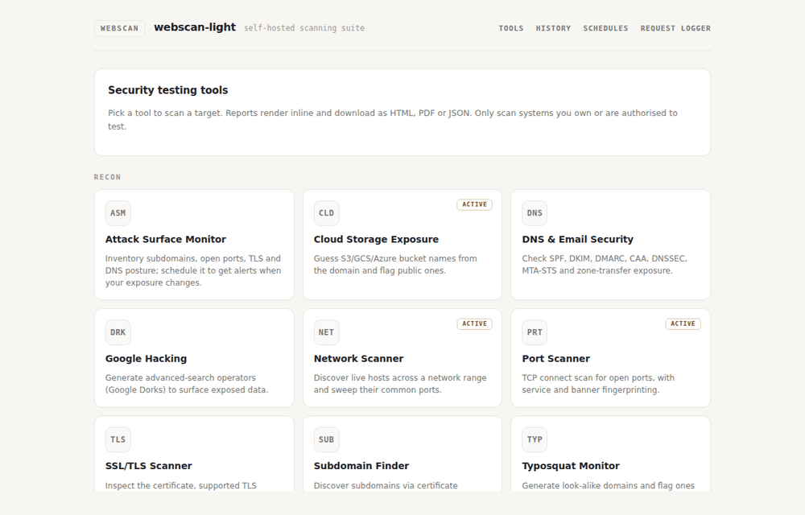
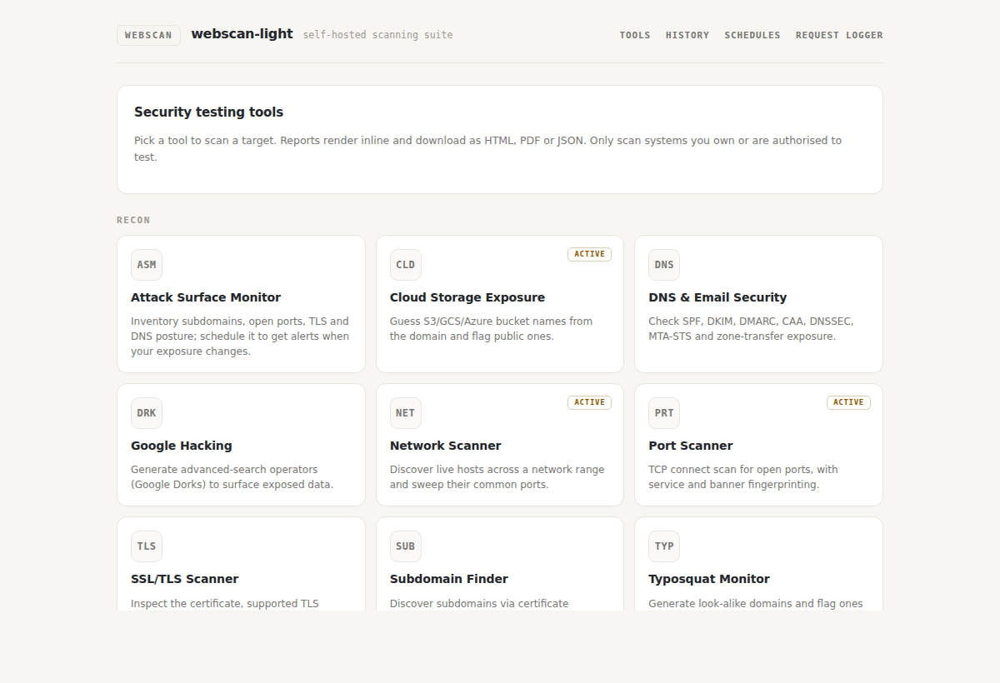
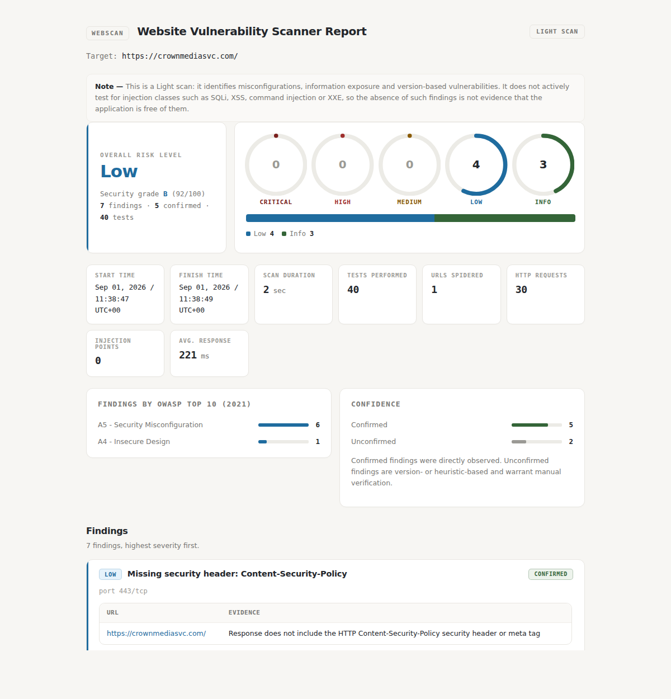
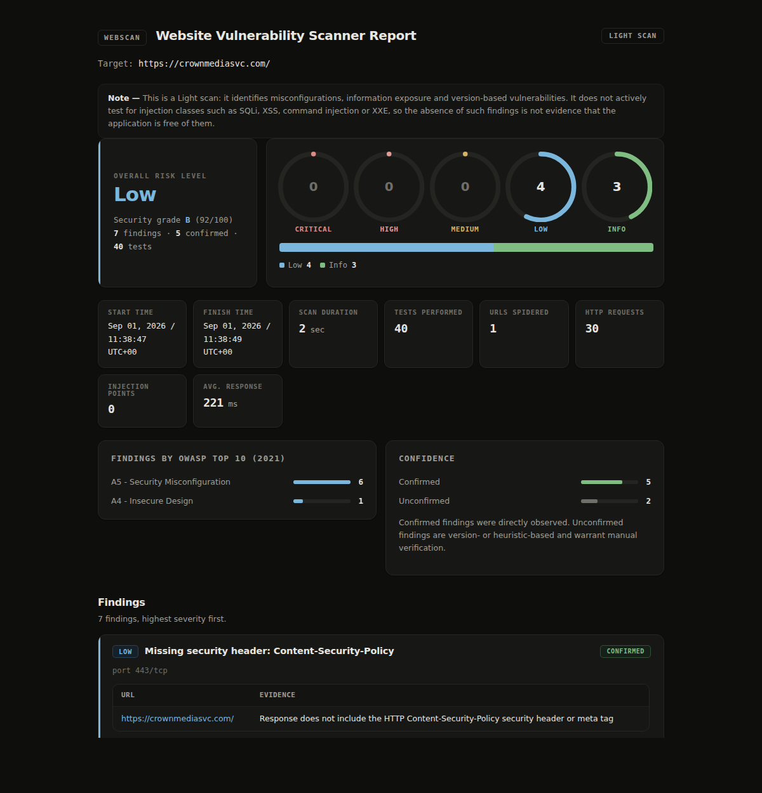
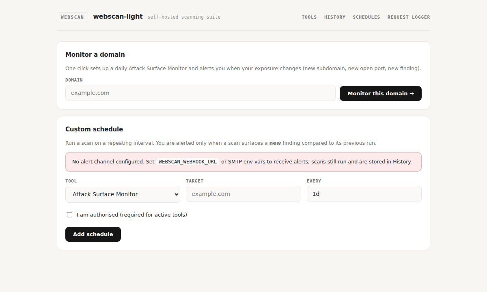
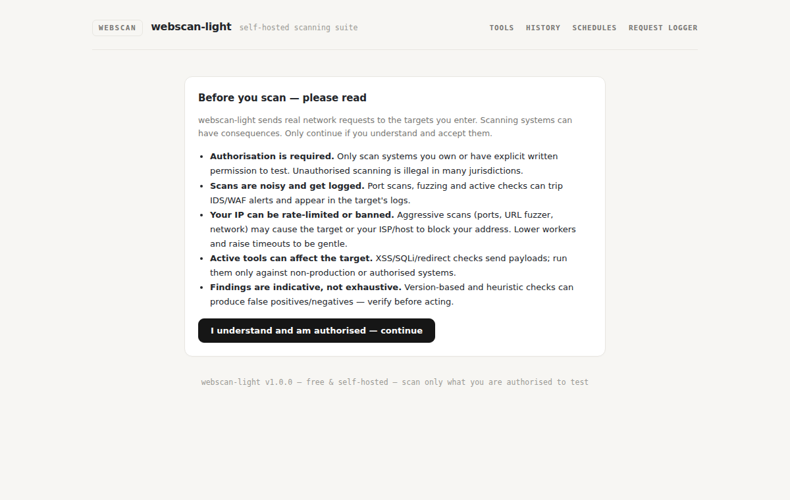

# webscan-light

A free, self-hosted website vulnerability scanner that produces a full
**Website Vulnerability Scanner Report (Light)** — the same report structure as
commercial light scanners, with no account, no quota and no data leaving your
machine.

Use it from the **CLI** or the **web UI**. Reports export to **HTML, PDF, JSON
and SARIF**.

```
Overall risk level   High
  Critical           0
  High               1
  Medium             0
  Low                3
  Info               5
Tests performed      40

┏━━━━━━┳━━━━━━━━━━━━━━━━━━━━━━━━━━━━━━━━━━━━━━━━━━━━━━━━━━┳━━━━━━━━━━━━━┓
┃ Risk ┃ Finding                                          ┃ Confidence  ┃
┡━━━━━━╇━━━━━━━━━━━━━━━━━━━━━━━━━━━━━━━━━━━━━━━━━━━━━━━━━━╇━━━━━━━━━━━━━┩
│ High │ Vulnerabilities found for nginx 1.18.0           │ Unconfirmed │
│ Low  │ Missing security header: Content-Security-Policy │ Confirmed   │
│ Low  │ Security.txt file is missing                     │ Confirmed   │
│ Low  │ HTTP OPTIONS enabled                             │ Confirmed   │
│ Info │ Server software and technology found             │ Unconfirmed │
└──────┴──────────────────────────────────────────────────┴─────────────┘
```

## Demo



| Tool launcher | Report (light) | Report (dark) |
| --- | --- | --- |
|  |  |  |

| Scheduled monitoring | Scan-safety gate |
| --- | --- |
|  |  |


## What it does

**40 tests**, run against every scan:

| Area | Tests |
| --- | --- |
| Version-based vulnerabilities | CVE matching against NVD, enriched with EPSS exploitation probability and the CISA KEV catalog |
| Fingerprinting | Web server, OS, frameworks, CMS, JS libraries, CDN, analytics — with versions |
| Security headers | CSP (missing and unsafe), HSTS, X-Content-Type-Options, Referrer-Policy, rate limiting |
| Well-known files | robots.txt, security.txt, crossdomain.xml, OpenAPI/Swagger, directory listing |
| Transport | Untrusted/expired certificates, HTTP→HTTPS redirection, mixed content, SRI on third-party scripts |
| Cookies | HttpOnly, Secure, over-broad Domain scoping |
| HTTP methods | OPTIONS, TRACE/TRACK/DEBUG and write methods |
| Information exposure | Emails, stack traces, debug output, developer comments, secrets and API keys, PEM private key material, full path disclosure, 5xx responses |
| Authentication surface | Login forms, passwords over HTTP, passwords in URLs, passwords echoed in responses, session tokens in URLs |
| Application surface | File upload endpoints, API endpoints, SQL fragments in parameters |

Run `webscan list-tests` for the full list with test ids.

**It is a light scan.** It does not send attack payloads — no SQL injection,
XSS, command injection, XXE or file-inclusion probing. A clean report is not
evidence that those classes of flaw are absent.

## The tool suite

Beyond the website scanner, `webscan run <tool> <target>` gives you a full recon
and testing suite. Run `webscan tools` to list them.

| Tool | id | What it does |
| --- | --- | --- |
| Website Recon | `recon` | DNS records, WHOIS/RDAP, HTTP headers and server tech at a glance |
| SSL/TLS Scanner | `ssl` | Certificate, protocol matrix (TLS 1.0-1.3), weak-cipher and expiry checks |
| Port Scanner | `ports` | TCP connect scan with service/banner fingerprinting |
| Network Scanner | `network` | Host discovery + port sweep across a CIDR or range |
| Subdomain Finder | `subdomains` | crt.sh certificate-transparency + DNS brute force |
| Virtual Host Finder | `vhosts` | Name-based vhosts served by one IP, via Host-header probing |
| URL Fuzzer | `urlfuzzer` | Brute-force hidden directories and files |
| Google Hacking | `dorks` | Generate ready-to-run Google dork queries |
| Subdomain Takeover | `takeover` | Dangling CNAMEs pointing at unclaimed cloud resources |
| API Scanner | `api` | OpenAPI/Swagger discovery and GraphQL introspection |
| XSS Detector | `xss` | Active reflected-XSS probing with a safe PoC *(needs `--authorized`)* |
| SQLi Detector | `sqli` | Error/boolean/time-based SQLi detection *(needs `--authorized`)* |
| DNS & Email Security | `dnsemail` | SPF, DKIM, DMARC, CAA, DNSSEC, MTA-STS and zone-transfer (AXFR) checks |
| Dependency Scanner | `deps` | Known-vulnerable dependencies via OSV.dev (PyPI, npm, Go, Cargo, …) |
| Web Misconfig Scanner | `webmisc` | CORS, clickjacking, open redirect, host-header and CRLF injection |
| Cloud Storage Exposure | `cloud` | Public S3/GCS/Azure buckets guessed from the domain |
| Secrets Scanner | `secrets` | Hard-coded credentials/keys/tokens in a local codebase |
| Typosquat Monitor | `typosquat` | Registered, live look-alike domains (brand protection) |
| Attack Surface Monitor | `asm` | Inventory subdomains/ports/TLS/DNS (+ host screenshots with `--render`); schedule it for change alerts |
| SSTI Detector | `ssti` | Server-side template injection (7*7=49 probe) *(needs `--authorized`)* |
| Command Injection | `cmdi` | OS command injection, output + time based *(needs `--authorized`)* |
| LFI / Path Traversal | `lfi` | Local file inclusion / path traversal *(needs `--authorized`)* |
| Stored XSS Detector | `storedxss` | Submit markers via forms, detect persistent XSS on re-crawl *(needs `--authorized`)* |
| Sniper | `sniper` | Runs recon + detection tools and aggregates findings into one report |

```bash
webscan run ssl example.com
webscan run ports example.com --ports top1000
webscan run subdomains example.com -f html -o subs.html
webscan run sqli "https://example.com/item?id=1" --authorized
webscan run sniper example.com -f pdf -o sniper.pdf
webscan run deps ./my-project           # scan a codebase's dependencies
webscan run secrets ./my-project        # find hard-coded secrets
webscan run dnsemail example.com        # email/DNS security posture
webscan run asm example.com             # attack-surface inventory
```

Website scans also get a **security grade (A-F)** with a shareable SVG badge
(`/report/<id>/badge.svg`) and a **compliance mapping** view
(`/report/<id>/compliance`) that ties findings to OWASP Top 10, PCI-DSS and ASVS.

**Active tools send requests to the target.** `xss`, `sqli` and `sniper` are
gated: they refuse to run without `--authorized` (CLI) or the authorization
checkbox (web UI). The Sniper aggregator is a discovery-and-detection tool only
— it never delivers exploit payloads, obtains shells, or reads the target
filesystem.

### Keeping CVE data current

CVE/EPSS/KEV lookups are cached on disk for 24h, so repeat scans hit no APIs and
`--offline` works fully. To keep scans both fast *and* current, refresh the cache
on a schedule instead of during a scan:

```bash
webscan update --kev                       # refresh the CISA KEV catalog
webscan update f5:nginx@1.18.0 php:php@8.2  # pre-warm CVEs for your stack
```

Run it from cron/systemd nightly. NVD is the source of truth and updates
continuously; if you never refresh you keep working from the last fetch.

### HTTP request logger

`webscan serve` includes a request logger for out-of-band testing (blind XSS,
SSRF, webhook checks). Create a unique URL in the UI, point payloads at
`/logger/<token>/...`, and captured requests stream into the page.

## Install

```bash
git clone https://github.com/lewisjohnvillamor/webscan-light.git
cd webscan-light

pip install -e .              # core: CLI scanning only (~4 MB of deps)
pip install -e ".[cli]"      # + rich terminal output
pip install -e ".[web]"      # + local web UI (Starlette + uvicorn)
pip install -e ".[all]"      # everything
```

Python 3.10+. No API keys required. The **core install needs only `requests`,
`beautifulsoup4` and `jinja2`** — no pydantic, no uvloop. `rich` and the web
stack are optional extras, so a headless/CI install stays tiny and the terminal
output degrades to plain text when `rich` is absent.

## CLI

```bash
webscan scan example.com                          # summary in the terminal
webscan scan example.com -f html -o report.html --open
webscan scan example.com -f pdf  -o report.pdf
webscan scan example.com -f json -o report.json
webscan scan example.com -f sarif -o report.sarif # for GitHub code scanning
webscan list-tests                                # every test and its id
```

Useful options:

| Option | Purpose |
| --- | --- |
| `--max-pages N`, `--max-depth N` | Crawl budget (default 15 pages, depth 2) |
| `--only IDS`, `--skip IDS` | Run or exclude specific tests by id |
| `--min-cvss N` | Drop CVEs below a CVSS score |
| `--offline` | Use only cached CVE/EPSS/KEV data; no outbound API calls |
| `-H 'Cookie: session=…'` | Extra request headers, e.g. to scan behind a login |
| `--insecure` | Do not verify the target's TLS certificate |
| `--include-exchanges` | Embed raw request/response pairs in HTML and PDF |
| `--fail-on high` | Exit 2 when a finding at or above that severity exists — for CI |

Exit codes: `0` clean, `1` scan error, `2` `--fail-on` threshold met.

## Web UI

```bash
webscan serve                 # http://127.0.0.1:8000
webscan serve --port 9000
```

Enter a target, watch the progress bar, then read the report inline or download
it as PDF/JSON/SARIF. The UI binds to **loopback only** by default — see
[Exposure](#exposure) before changing that.

## Docker

Pull the published image (built and pushed to GHCR by the release workflow on
every `v*` tag):

```bash
docker run -d -p 127.0.0.1:8000:8000 \
  -e WEBSCAN_TOKEN=$(openssl rand -hex 16) \
  -v webscan-data:/data -e WEBSCAN_DATA_DIR=/data \
  ghcr.io/lewisjohnvillamor/webscan-light:latest
```

Or build locally with compose:

```bash
docker compose up -d          # UI on http://127.0.0.1:8000
docker compose run --rm webscan scan example.com -f json
```

The image includes a headless Chromium for PDF export and a `/health`
HEALTHCHECK. It binds to loopback in the compose file — see
[Self-hosting](#self-hosting-security-history-and-scheduling) before exposing it.

## CI usage

```yaml
- name: Scan staging
  run: |
    pip install webscan-light
    webscan scan https://staging.example.com -f sarif -o results.sarif --fail-on high
- uses: github/codeql-action/upload-sarif@v3
  with:
    sarif_file: results.sarif
```

## How CVE matching works

1. The fingerprinter extracts `software + version` (e.g. `nginx 1.18.0`).
2. That is turned into a CPE and matched against the **NVD** API 2.0, which
   returns every CVE whose affected-version ranges cover it.
3. Each CVE is enriched with its **EPSS** score and percentile (FIRST) and
   checked against the **CISA KEV** catalog.
4. Results are cached on disk for 24 hours, so repeat scans are instant and
   `--offline` works.

All three feeds are free and need no key. NVD rate-limits anonymous callers to
5 requests per 30 seconds; set `WEBSCAN_NVD_API_KEY` for a
[free key](https://nvd.nist.gov/developers/request-an-api-key) and a much
higher quota.

Because this is version-based detection rather than active exploitation,
findings are reported as **Unconfirmed** and capped at **High** severity —
never Critical.

## Self-hosting: security, history and scheduling

### Authentication

The web UI is unauthenticated by default (intended for `127.0.0.1`). When you
expose it, set an access token:

```bash
WEBSCAN_TOKEN=$(openssl rand -hex 16) webscan serve --host 0.0.0.0
```

Browsers sign in at `/login`; automation sends `Authorization: Bearer <token>`
(or `X-Webscan-Token`). `/health` and the request-logger capture URLs stay
public. `serve` warns if you bind to a non-loopback address without a token.

### SSRF scope guard

Because the server fetches whatever target a caller names, the web UI blocks
targets that resolve to loopback, private, link-local, reserved or cloud-metadata
addresses (every resolved IP is checked, defeating DNS-rebinding). To scan your
own internal network on purpose, opt in:

```bash
WEBSCAN_ALLOW_PRIVATE=1 webscan serve
```

The CLI is not scope-restricted — it runs with your own privileges.

### History

Every finished scan (CLI or web) is stored in SQLite and can be re-opened or
exported later.

```bash
webscan history                 # list stored scans
```

In the UI, the **History** tab lists past scans with HTML/PDF/JSON links.
Storage lives under `~/.local/share/webscan-light/` (override with
`WEBSCAN_DATA_DIR` or `WEBSCAN_DB`).

### Scheduled scans + alerts

Run a scan on a repeating interval and get alerted only when a **new** finding
appears versus the previous run.

```bash
webscan schedule website https://example.com --every 1d
webscan schedule ssl example.com --every 12h
webscan schedules                       # list
webscan scheduler                       # run the loop headless (no UI)
```

The scheduler also runs inside `webscan serve` (the **Schedules** tab manages
it). Configure alert channels via env:

| Variable | Purpose |
| --- | --- |
| `WEBSCAN_WEBHOOK_URL` | POST a JSON payload (Slack/Discord/generic) on new findings |
| `WEBSCAN_SMTP_HOST` / `_PORT` / `_USER` / `_PASSWORD` / `_FROM` / `_TO` | email alerts |

Scans still run and are stored even with no alert channel configured.

## Configuration

| Environment variable | Effect |
| --- | --- |
| `WEBSCAN_NVD_API_KEY` | NVD API key, for a higher rate limit |
| `WEBSCAN_CACHE_DIR` | Cache location (default `~/.cache/webscan-light`) |
| `WEBSCAN_CHROME` | Path to Chrome/Chromium for PDF export |
| `WEBSCAN_TOKEN` | Require this token to use the web UI/API |
| `WEBSCAN_ALLOW_PRIVATE` | Permit scanning private/internal targets from the web UI |
| `WEBSCAN_DATA_DIR` / `WEBSCAN_DB` | Where scan history is stored |
| `WEBSCAN_WEBHOOK_URL`, `WEBSCAN_SMTP_*` | New-finding alert channels |
| `WEBSCAN_NO_SCHEDULER` | Set to 1 to disable the in-server scheduler |
| `WEBSCAN_SCAN_TTL` | Seconds to reuse a recent identical scan (default 600; 0 = off) |
| `WEBSCAN_NO_CONSENT` | Set to 1 to skip the web scan-safety consent gate |

PDF export drives a headless Chromium. If none is found, `-f pdf` writes the
HTML report instead and tells you — every other format works without it.

## Exposure

The web UI has **no authentication**, and anyone who can reach it can make your
server issue HTTP requests to any address they name — including hosts on your
internal network. Keep it on loopback, or put it behind a reverse proxy that
authenticates, and restrict egress. `--host 0.0.0.0` is for trusted networks
only.

## Extending it

A check is a function that returns findings, registered with a decorator. The
description you register is the line that appears in the report's "tests
performed" list, so the coverage section can never drift from what actually ran.

```python
from webscan.core.registry import check
from webscan.core.models import Finding, Severity, Table

@check("my_test", "Scanned for my own condition")
def my_check(context):
    response = context.fetch("/some-path")
    if response.status_code != 200:
        return []
    return [Finding(
        test_id="my_test",
        title="Something noteworthy",
        severity=Severity.LOW,
        port=context.port,
        table=Table(columns=["URL"], rows=[[response.url]]),
        risk_description="Why this matters.",
        recommendation="What to do about it.",
    )]
```

Add the module to `webscan/checks/__init__.py` and it runs, appears in
`list-tests`, and shows up in every report format.

## Development

```bash
pip install -e ".[web,dev]"
pytest                        # runs against a local fixture server, no network
```

## Legal

Scan only systems you own or have written permission to test. Unauthorised
scanning is illegal in many jurisdictions. The authors accept no liability for
misuse.

## Caching & load

webscan-light avoids hammering targets and public APIs:

- **Scan reuse** — the web UI serves a recent identical scan (same tool + target
  within `WEBSCAN_SCAN_TTL`, default 600s) instead of re-running; tick *Force
  fresh scan* to override. Set `WEBSCAN_SCAN_TTL=0` to disable.
- **Vulnerability data** — NVD/EPSS/CISA-KEV and OSV results are cached on disk
  for 24h; `--offline` uses only the cache. DNS lookups are memoised per run.
- **History** — every finished scan is stored in SQLite and re-openable without
  re-scanning.

## Limitations & accuracy

- **Light, mostly passive scanning.** Version- and heuristic-based checks can
  produce **false positives and false negatives** — always verify before acting.
  Version-based CVE findings are marked *Unconfirmed* and capped at High.
- **Bucket/typosquat name guessing** is heuristic; a match is not proof of
  ownership or malice.
- **Zone-transfer / AXFR and port checks** are best-effort TCP probes and can be
  affected by firewalls, filtering and rate limits.
- **PDF export** needs a headless Chromium (falls back to HTML if absent).
- This is **not** a replacement for a deep/authenticated scan or a manual
  penetration test.

## Responsible use & precautions

Read this before scanning anything you do not own:

- **Authorisation is mandatory.** Only scan systems you own or have explicit
  written permission to test. Unauthorised scanning is illegal in many places.
- **Scans are noisy and logged.** Port scans, fuzzing and active checks trip
  IDS/WAF alerts and show up in the target's logs.
- **Your IP can be rate-limited or banned.** Aggressive scans (`ports`,
  `network`, `urlfuzzer`) may get your address blocked by the target, its CDN,
  or your own ISP/host. Lower `--workers` and raise `--timeout` to be gentle.
- **Active tools send payloads.** `xss`, `sqli`, `webmisc` and `sniper` are
  gated behind an explicit authorisation flag/checkbox for a reason — run them
  only against non-production or authorised systems.
- The web UI shows a one-time **consent gate** covering the above
  (`/consent`; bypass with `WEBSCAN_NO_CONSENT=1` for headless/API use).

## License

**GNU AGPL-3.0-or-later.** You are free to use, run, study, modify and share
this software. The AGPL adds one condition to the GPL: if you run a modified
version as a network service, you must offer that service's users the modified
source. This keeps the project — and any hosted fork of it — free and open.

If you need a permissive license (e.g. to embed in a closed-source product),
open an issue to discuss; MIT/Apache-2.0 dual-licensing can be considered.
